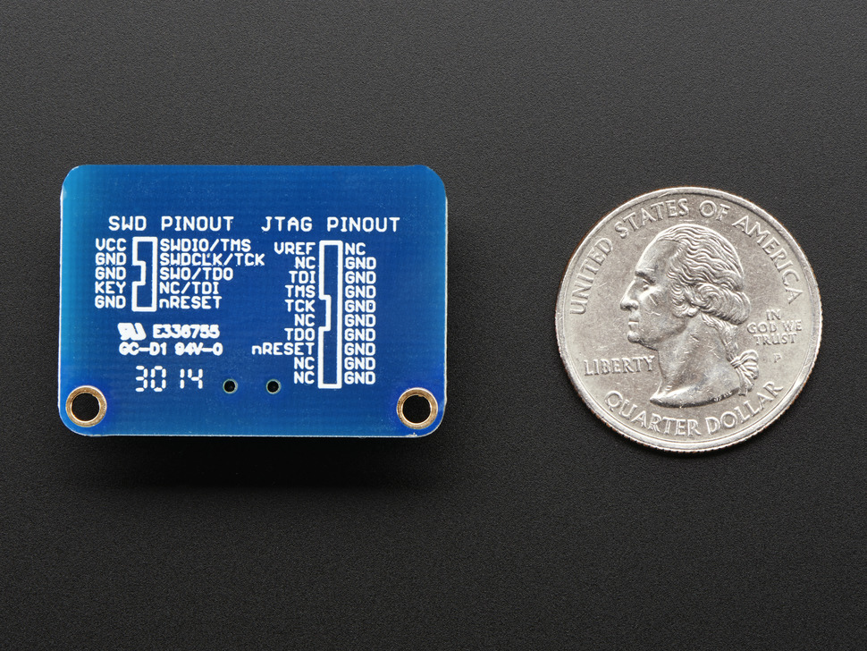

# PyCubed Firmware

Low-level code that implements CircuitPython.

Firmware and bootloader configurations are kept here because each of the repositories has many submodules that arent necessary for the project as a whole (and we don't want anyone to accidentally clone them).

## Building the Bootloader

The bootloader is a smaller (than CP) piece of software that is loads your version of CircuitPython. This is nice because you can switch versions of CircuitPython without using a JLink. Check out the instructions in the README of the [SSI fork of UF2-SAMD1X](https://github.com/stanford-ssi/uf2-samdx1). It might also have the configuration that is stored in `bootloader_build/` but when in doubt, use this repository.

## Flashing the Bootloader
If you have a Mac and a J-Link, follow the instructions here. Otherwise, follow [these instructions](https://www.notion.so/Programming-the-Bootloader-343b47d1ad6f4863b512d6464aa7b84e) 
- Install JLink Software Tools [here](https://www.segger.com/downloads/jlink/). 
- Plug your JLink into the PyCubed board, according to this wiring diagram. The Adafruit Cortex SWD Adapter is very helpful for managing wires as PyCubed does not have a JTAG/SWD headers with the standard connector. 

The left side of this picture depicts the SWD pins on the JLink connector. 

| PyCubed | SWD | JTAG |
|---------|------|-----|
|3V3 	  |VCC   |VREF |
| SWDIO  | SWDIO/TMS | TMS |
| SWDCLK | SWCLK/TCK | TCK | 
| RESET | nReset | nReset |
| GND | GND | GND |

- Open JFlash Lite
- Select the version of SAMD51 you have
- Select the bootloader binary you want to flash
- Erase the chip
- Load the bootloader :-)

## Building CircuitPython

Check out Adafruit's guide (make sure you have the correct version of the ARM toolchain). It might also have the configuration that is stored in `firmware_build/`. The configuration setup changes from time to time, so we've done our best to explain the necessary changes you may have to make for a specific SAMD51/memory variant.

## Loading a CircuitPython UF2 on a PyCubed Board
UF2s are a special type of file that are ingested and loaded by the (UF2) Bootloader
- be sure to use the right memory/SAMD51 version for your board
- 6.2, 7.0 Alpha versions have a SPI error that breaks the SD card.
- 6.0 is stable to the best of our knowledge

 
 This work is licensed under a <a rel="license" href="http://creativecommons.org/licenses/by/4.0/">Creative Commons Attribution 4.0 International License</a>.
